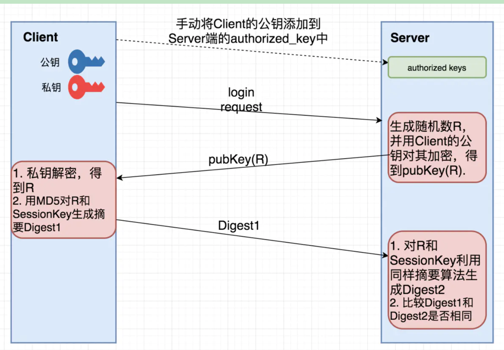

## why we use ssh in github

#### ssh的介绍：https://www.jianshu.com/p/33461b619d53

基本描述：

1. Client将自己的公钥存放在Server上，追加在文件authorized_keys中。
2. Server端接收到Client的连接请求后，会在authorized_keys中匹配到Client的公钥pubKey，并生成随机数R，用Client的公钥对该随机数进行加密得到pubKey(R)
    ，然后将加密后信息发送给Client。
3. Client端通过私钥进行解密得到随机数R，然后对随机数R和本次会话的SessionKey利用MD5生成摘要Digest1，发送给Server端。
4. Server端会也会对R和SessionKey利用同样摘要算法生成Digest2。
5. Server端会最后比较Digest1和Digest2是否相同，完成认证过程。

### so, github的认证就是干了这么一件事

### 

